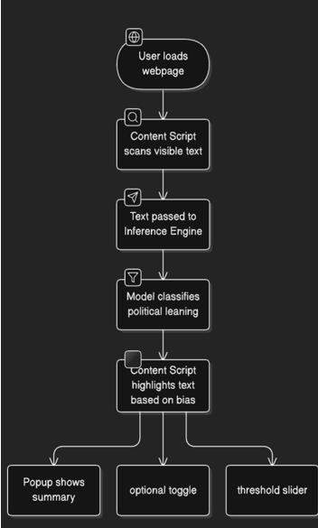
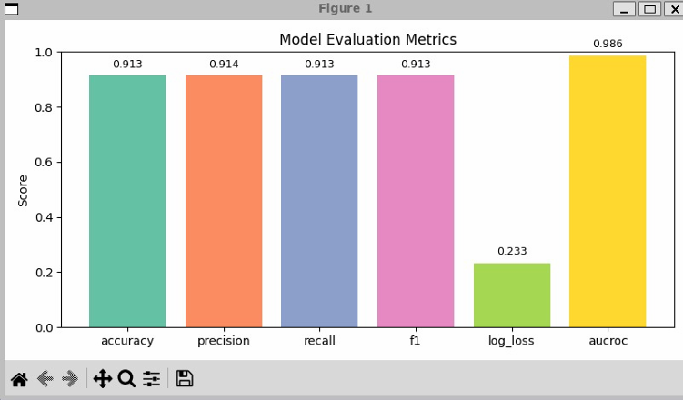
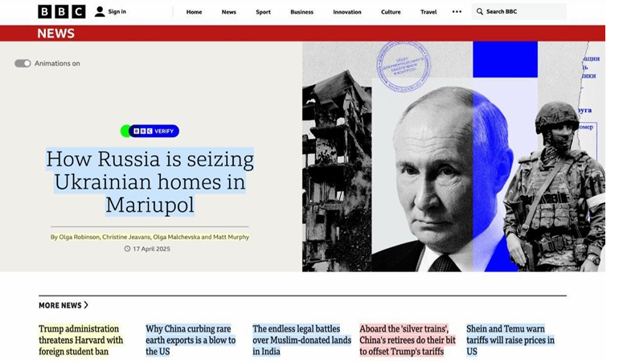

# Political Bias Detection in News Articles

This project develops a **Chrome extension** that detects political bias in news articles in real-time. By leveraging advanced natural language processing (NLP) techniques, particularly BERT-based models, the system classifies articles into **Left, Center, or Right** categories. The Chrome extension extracts the main content from news articles and sends it to a backend model for prediction.

---

## Workflow of Events

1. **User Browsing**: The user browses news articles on various websites.
2. **Text Extraction**: The Chrome extension automatically extracts the main content of the article from the webpage.
3. **Bias Prediction**: The extracted text is sent to the server, where the trained model predicts the article's political bias (Left, Center, or Right).
4. **Display Results**: The Chrome extension displays the classification (e.g., Left, Center, Right) on the article, either color-coded or as a notification.



---

## Tools and Technologies Used

- **Natural Language Processing (NLP)**: For analyzing and classifying political bias.
- **BERT-based Model (RoBERTa)**: Pre-trained transformer model fine-tuned for political bias detection.
- **Python**: For data preprocessing, model training, and backend.
- **Flask/FastAPI**: Backend frameworks for API deployment.
- **JavaScript**: For the Chrome extension and user interface.
- **HTML/CSS**: For the extension popup and UI elements.
- **PyTorch/TensorFlow**: Model training and inference.
- **GitHub**: Version control and project hosting.


---

## Datasets Used

1. **[AllSides Ratings of Bias in Electronic Media (Kaggle)](https://www.kaggle.com/datasets/supratimhaldar/allsides-ratings-of-bias-in-electronic-media)**  
   A labeled dataset of articles classified by political bias.

2. **[AllSides News Articles](https://www.allsides.com/unbiased-balanced-news)**  
   Source for balanced news and media bias ratings.

3. **[Article-Bias-Prediction (GitHub)](https://github.com/ramybaly/Article-Bias-Prediction)**  
   Large-scale dataset for article bias prediction, currently used for model training and evaluation.

---

## Data Preprocessing Steps

1. **Text Extraction**: Extract content from datasets.
2. **Tokenization**: Split text into tokens using HuggingFace's tokenizer.
3. **Text Cleaning**: Remove stop words, special characters, and unnecessary content.
4. **Normalization**: Convert text to lowercase and handle inconsistencies.
5. **Data Augmentation**: Use techniques like SMOTE for class balancing (if required).

**Libraries Used**:
- `pandas` (data manipulation)
- `nltk`, `spaCy` (text preprocessing/tokenization)
- `transformers` (HuggingFace)
- `scikit-learn` (data splitting, cross-validation, etc.)

---

## Model Training

- **Model**: RoBERTa (variant of BERT), pre-trained and fine-tuned for this task.
- **Training Steps**:
  1. Fine-tune RoBERTa with the labeled dataset.
  2. Use **Cross-Entropy Loss** for multi-class classification.
  3. Evaluate using accuracy, precision, recall, and F1 score.

**Libraries**:  
- `PyTorch`  
- `transformers` (HuggingFace)

---

## Model Evaluation



## Working of Project


---

## Instructions to Run Locally

### 1. Clone the Repository

```bash
git clone https://github.com/peekayitachi/Political-Bias_test.git
cd Political-Bias_test
